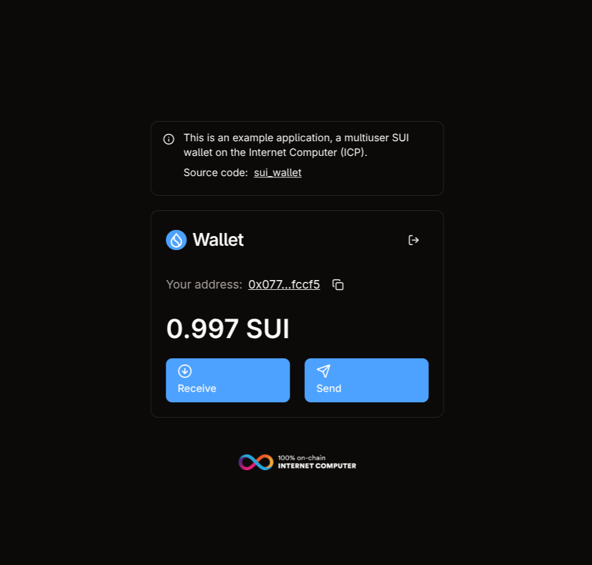

# A multiuser SUI wallet built on the Internet Computer (ICP)

This multiuser Sui wallet allows the user to generate a Sui
address by logging in with their Internet Identity. The user can then send and receive Sui tokens to other users.

The backend canister uses the [Sui API](https://docs.sui.io/) to interact with the Sui blockchain.

The frontend is built with React and Vite.

> [!TIP]
> Use this repository as a starting point for building your own multiuser Sui wallet on the Internet Computer.

[![Contributors][contributors-shield]][contributors-url]
[![Forks][forks-shield]][forks-url]
[![Stargazers][stars-shield]][stars-url]
[![Issues][issues-shield]][issues-url]
[![MIT License][license-shield]](LICENSE)


## Try it!

You can try a predeployed versions of the wallet:

Testnet: <https://ltouy-taaaa-aaaas-qcoca-cai.icp0.io>



## Project notes

At all times when interacting with canisters on the IC you should consider the
costs involved, and the fact that update calls take 2-3 seconds to complete.

- The Sui public key is retrieved from the backend canister on each login and
  cached using React Query for the current session.
- The balance and transactions are queried from the Sui blockchain via the Sui
  RPC API. The backend canister handles signing transactions using the user's derived private key.

> [!IMPORTANT]
> This project is not affiliated with or endorsed by the DFINITY Foundation. It has not undergone any formal security review and is intended for educational and experimental purposes only. Do not use this code in production environments.

## Setup, pre-requisites

Setup your Internet Computer developer environment.

[https://internetcomputer.org/docs/current/developer-docs/](https://internetcomputer.org/docs/current/developer-docs/)

## Deploying the project

### 1. Start the Internet Computer

```bash
dfx start --clean
```

### 2. Install dependencies

```
pnpm install
```

### 3. Deploy the canisters

```
dfx deploy
```

> [!TIP]
> If you get a permissions error when deploying, you might need to set the execute
> bit on the build script.
>
> ```
> chmod +x build.sh
> ```

## Develop

During development, you can run the frontend with hot reloading using Vite.

```bash
pnpm run dev
```

## Before you start testing

> [!IMPORTANT]
> Make sure your Sui testnet configuration is set up correctly and you have testnet tokens for testing transactions.

## Backend canister methods

### `get_public_key`

Get the secp256k1 public key for the calling principal.

Call signature:

```
get_public_key : () -> (result : variant { Ok : vec nat8; Err : text });
```

Get the public key for the calling principal:

```bash
dfx canister call backend get_public_key
```

### `sign`

Sign a 32-byte message digest using the ECDSA key derived for the calling principal.

Call signature:

```
sign : (msg : vec nat8) -> (result : variant { Ok : vec nat8; Err : text });
```

Sign a message (must be exactly 32 bytes):

```bash
dfx canister call backend sign '(vec { /* 32 bytes */ })'
```

## Contributors

<!-- readme: collaborators,contributors -start -->
<table>
	<tbody>
		<tr>
            <td align="center">
                <a href="https://github.com/kristoferlund">
                    
                    <br />
                    <sub><b>Kristofer</b></sub>
                </a>
            </td>
		</tr>
	<tbody>
</table>
<!-- readme: collaborators,contributors -end -->

## License

This project is licensed under the MIT License. See the LICENSE file for more
details.

## Contributing

Contributions are welcome! Please open an issue or submit a pull request if you
have any suggestions or improvements.

[contributors-shield]: https://img.shields.io/github/contributors/kristoferlund/sui-wallet.svg?style=for-the-badge
[contributors-url]: https://github.com/kristoferlund/sui-wallet/graphs/contributors
[forks-shield]: https://img.shields.io/github/forks/kristoferlund/sui-wallet.svg?style=for-the-badge
[forks-url]: https://github.com/kristoferlund/sui-wallet/network/members
[stars-shield]: https://img.shields.io/github/stars/kristoferlund/sui-wallet?style=for-the-badge
[stars-url]: https://github.com/kristoferlund/sui-wallet/stargazers
[issues-shield]: https://img.shields.io/github/issues/kristoferlund/sui-wallet.svg?style=for-the-badge
[issues-url]: https://github.com/kristoferlund/sui-wallet/issues
[license-shield]: https://img.shields.io/github/license/kristoferlund/sui-wallet.svg?style=for-the-badge
[license-url]: https://github.com/kristoferlund/sui-wallet/blob/master/LICENSE.txt
